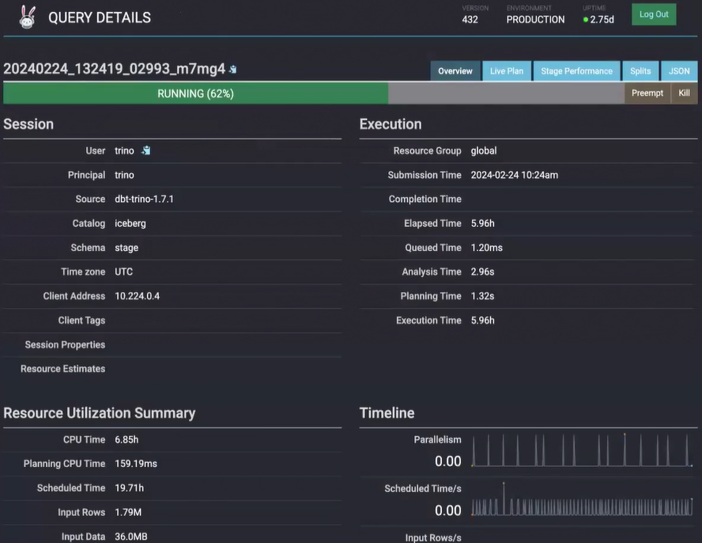

# Modern Data Stack with Kubernetes
## Architecture

## Overview
The Modern Data Stack with Kubernetes is a project that aims to create a complete data environment using the best practices of the market. The project is structured in 3 parts:
1) [Infra](#infra): All the resources needed to create a Kubernetes cluster as well as the components needed for the data environment using GitOps.
2) [Apps](#apps): Development of an application that creates files in json or parquet to put in the landing zone folder of a data lake, in this case using MinIO (s3).
3) [Data](#data): Creation of a data pipeline using Apache Airflow, Trino & dbt-Core to create a complete end-to-end data environment.

### Infra
All the resources needed to create a Kubernetes cluster as well as the components needed for the data environment using GitOps.

To deploy the environment, follow the steps:
1) [Kubernetes](https://github.com/owshq-academy/ws-stack-dados-k8s/blob/cce5c1e4ca78e19f58c114a4f6f5ee25c5b5332a/infra/terraform/kubernetes/aks/orion-development/readme.md)
2) [GitOps](https://github.com/owshq-academy/ws-stack-dados-k8s/blob/e6a934db161f71a691374bfd57192e7cad8d4a3b/infra/terraform/gitops/argocd/readme.md)
3) [Deployment](https://github.com/owshq-academy/ws-stack-dados-k8s/blob/e6a934db161f71a691374bfd57192e7cad8d4a3b/infra/src/readme.md)

### Apps
Development of an application that creates files in json or parquet to put in the landing zone folder of a data lake, in this case using MinIO (s3).

To understand the application, follow the steps:
1) [Data Gen DataStores](https://github.com/owshq-academy/ws-stack-dados-k8s/blob/6c3b885f044d67ac60f6ee2d6e6fca5dcc5e0fa2/app/data-gen-datastores/readme.md)

### Data
Creation of a data pipeline using Apache Airflow, Trino & dbt-Core to create a complete end-to-end data environment.

To build the data environment, follow the steps:
1) [Trino](https://github.com/owshq-academy/ws-stack-dados-k8s/blob/e6a934db161f71a691374bfd57192e7cad8d4a3b/data/sql)
2) [dbt Core](https://github.com/owshq-academy/ws-stack-dados-k8s/blob/8abc244ebdaa999021a76777ac5362ba5956c40d/data/dags/dbt/owshq)
3) [Apache Airflow](https://github.com/owshq-academy/ws-stack-dados-k8s/blob/8abc244ebdaa999021a76777ac5362ba5956c40d/data/dags/dbt_sql_transform.py)

## Results

### Kubernetes

### ArgoCD

### MinIO

### Trino & Iceberg

### Apache Airflow & dbt-Core

### Metabase
